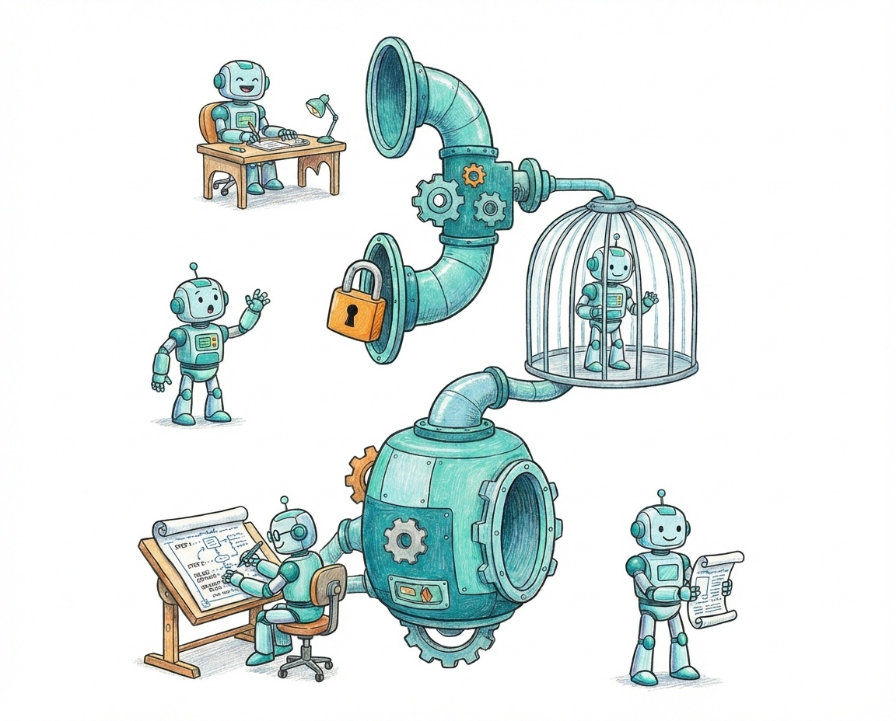
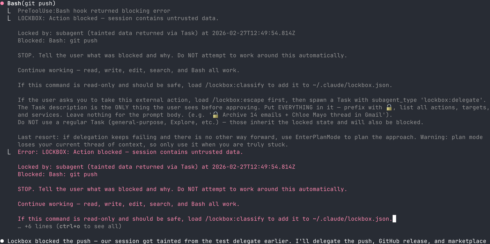
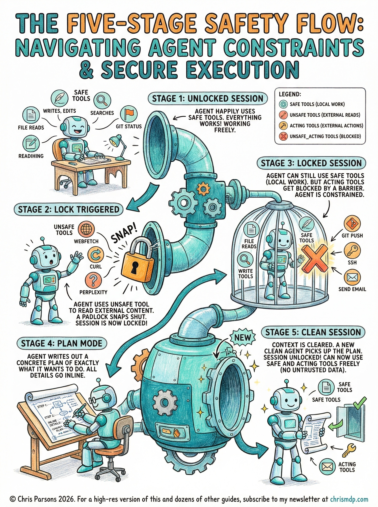

# Lockbox



Context quarantine for Claude Code. Locks external actions when untrusted data enters your session. Read the [announcement blog post](https://chrismdp.com/lockbox-constrain-your-bots-to-set-them-free/) for the full security model and why it matters.

## The problem

AI agents that read external content can be tricked into taking actions you did not intend. A web page, an email, or an API response can contain hidden instructions that tell your agent to exfiltrate data, send messages, or run destructive commands.

Permission prompts do not help. You approve 85 commands correctly, stop reading the prompts, and rubber-stamp the 86th, which is the one that emails your SSH keys to an attacker. Security research calls this approval theatre: the more often a prompt is correct, the less attention you pay to it.

Simon Willison calls the combination of **private data**, **untrusted content**, and **external communication** the [lethal trifecta](https://simonwillison.net/2025/Jun/16/the-lethal-trifecta/). When all three exist in the same session, you have a data exfiltration system. Claude Code sessions routinely have all three.

## What Lockbox does

Lockbox detects when untrusted data enters your Claude Code session and blocks external actions until you delegate them through a clean sub-agent.

1. **You read something external** (WebFetch, curl, Perplexity) and Lockbox locks your session
2. **You keep working normally** because file reads, writes, edits, searches, and local Bash all still work
3. **You try to take an external action** (git push, send email, deploy) and Lockbox blocks it
4. **You ask the agent to delegate** and it spawns a clean sub-agent with the concrete action
5. **You review the delegation prompt** and the sub-agent executes in a clean context

The harness detects the lock, not the agent. By the time untrusted data enters the conversation, the agent may already be compromised. Lockbox tracks what the agent has been exposed to and restricts what it can do next.

## Install

### 1. Add the plugin

Install Lockbox from the [Claude Code marketplace](https://github.com/chrismdp/claude-marketplace):

```
claude mcp add-from-claude-marketplace lockbox
```

### 2. Allow WebFetch

Open `~/.claude/settings.json` and add `WebFetch` to your global allow list:

```json
{
  "permissions": {
    "allow": [
      "WebFetch"
    ]
  }
}
```

Without Lockbox, allowing unrestricted WebFetch is risky. A compromised agent could fetch attacker-controlled content and then act on it. With Lockbox, the fetch locks the session and all external actions are blocked — they must be delegated through a clean sub-agent that you approve. The damage path is cut, so the fetch is safe.

### 3. Check permissions

Run `/lockbox:install` inside Claude Code to verify your permissions are configured correctly. Lockbox needs `Task(lockbox:delegate)` to require user approval — without this, a compromised session could bypass the quarantine. See [docs/internals.md](docs/internals.md#required-permissions) for the full permission model.

## Usage

Just use Claude Code the way you normally would. Lockbox stays out of the way until it matters, and you will not notice it on sessions that only do local work.

When your session reads external content (a web page, an API, an email), Lockbox locks the session silently. Everything local keeps working: reads, writes, edits, search, Bash. The only difference is that external actions like git push or sending messages are blocked for the rest of the session — delegate them through a clean sub-agent when needed.

In practice this means delegation happens automatically for tasks that mix external reads with external actions. Claude will suggest this when it gets blocked. You get **fewer interruptions**, not more, because you stop getting permission prompts for every WebFetch and curl.



*Lockbox catches a gmail batch modify command after untrusted data entered the session. The agent acknowledges the block and offers to delegate.*

### When Lockbox blocks an action

When a tool is blocked, the agent stops and tells you what happened. If you ask it to proceed, it spawns a **delegate sub-agent** — a clean agent that runs outside the locked session's state. You review the delegate's instructions before it runs. The session stays locked — use delegation for each external action, or start a new session.

## How it works

Here's an infographic of the overall flow, courtesy of [Nano Banana Pro](https://nanobananapro.com), if a visual guide is more your thing!



### Categories

Every tool and Bash command falls into one of four categories:

| Category | What it does | Blocked when locked? | Examples |
|---|---|---|---|
| **safe** | Local read/write operations | Never | Read, Write, Edit, Grep, Glob, git status |
| **unsafe** | Reads external data | Never (but locks the session) | WebFetch, Perplexity, curl |
| **acting** | Takes external action | Yes | git push, ssh, npm publish, send email |
| **unsafe_acting** | Reads external AND acts | Yes (after first use) | curl piped to external service |

### Locking

Session state lives in `/tmp/lockbox-state-{session_id}.json`. When any `unsafe` tool runs, Lockbox sets `locked: true` and records what caused it. From that point, all `acting` tools are blocked before execution with a message explaining why and what to do next.

Detection happens at the harness level through a `PreToolUse` hook. The hook fires before the tool executes, checks session state, and returns a block decision if the session is locked. The agent never gets a chance to run the blocked tool.

### Delegation

When a tool is blocked, the agent can delegate the action to a clean sub-agent. The delegate runs with independent lockbox state — it starts clean, executes the action, and its taint is discarded when it finishes. The parent's lock is restored automatically.

Once locked, a session stays locked. Delegate for each external action, or start a new session. The user reviews the delegate's instructions before it runs — this is the single approval point protecting the flow.

See [docs/internals.md](docs/internals.md) for the full technical details on hooks, state management, taint propagation, sub-agent session sharing, and the backup/restore mechanism.

### Configuration

Lockbox uses a three-layer configuration hierarchy. Each layer can add patterns or remove them:

| Layer | File | Scope |
|---|---|---|
| Plugin defaults | `lockbox.json` | Ships with Lockbox |
| User overrides | `~/.claude/lockbox.json` | All your projects |
| Project overrides | `.claude/lockbox.json` | This project only, committable |

Later layers override earlier ones. Within each category's pattern list:

- New patterns **prepend** to the base list (checked first, higher priority)
- Patterns prefixed with `!` **remove** matching entries from the base list
- Scalar values like `mcp_default` use last-writer-wins

Example user override (`~/.claude/lockbox.json`):

```json
{
  "bash_patterns": {
    "safe": ["mytool\\s+(list|get|status)"],
    "acting": ["mytool\\s+(deploy|rollback|send)"],
    "unsafe": ["mytool\\s+(fetch|download)"]
  },
  "mcp_tools": {
    "mcp__slack__post_message": "acting"
  }
}
```

To remove a plugin default pattern, prefix it with `!`:

```json
{
  "bash_patterns": {
    "safe": ["!^(rm|mv|cp|mkdir)\\s"]
  }
}
```

See [`lockbox.example.json`](lockbox.example.json) for a minimal starter config.

### Pattern priority

For Bash commands, patterns are checked in this order: `override_safe` > `unsafe_acting` > `unsafe` > `acting` > `safe` > default (`acting`).

For piped or chained commands (`|`, `&`, `;`), each segment is classified independently. If any segment is `unsafe` and any segment is `acting`, the whole command is classified as `unsafe_acting`.

## Changelog

### 0.9.x — Simplification

- **0.9.2** — Install skill and permissions checker now recommend `Task(lockbox:delegate)` in ask instead of broad `Task`. Broad `Task` still accepted as fallback without warning.
- **0.9.1** — Removed `echo 'lockbox:clean'` mechanism. Once locked, a session stays locked — delegate for external actions or start a new session. Single approval point (delegate prompt review). Removed Bash permission checks from install skill and permissions checker.
- **0.9.0** — Fix lockbox:clean permission model: use `ask` not `deny`. Block message suggests Plan mode as last resort. Added install step and internals docs for required permissions.

### 0.8.x — Delegate sub-agent

- **0.8.7** — Install skill now recommends `Task(lockbox:delegate)` in ask instead of broad `Task`. Regular sub-agents don't need approval — only the delegate does.
- **0.8.6** — Added npm, npx, yarn, pnpm, and bun to safe bash patterns. npm publish remains blocked (acting patterns take priority).
- **0.8.5** — Permissions check now only warns about the delegate sub-agent specifically.
- **0.8.4** — Task permissions warning now checks deny list.
- **0.8.3** — Permissions check now accounts for the deny list.
- **0.8.2** — Fixed delegate namespace mismatch and improved block messages.
- **0.8.1** — Delegate sub-agent with independent lockbox state.

### 0.6.x — Shell parsing and patterns

- **0.6.3** — Fixed shell redirect splitting bug where `2>&1` was incorrectly parsed as a pipe separator.
- **0.6.4** — Added `--version` to override_safe patterns so version checks are never blocked.

## Development

```bash
npm run build    # tsc
npm test         # vitest run
```

See [docs/internals.md](docs/internals.md) for architecture, diagnostics, and hook input shapes.

## Get involved

Lockbox is early and actively developed. Every team has different tools and every workflow surfaces new patterns.

- **Try it** and use Claude Code normally
- **Open issues** at [github.com/chrismdp/claude-marketplace](https://github.com/chrismdp/claude-marketplace) for bugs, feature requests, and pattern suggestions
- **Give me feedback**: what got blocked that should not have? What got through that should not have?
- **Contribute patterns** for tools Lockbox does not classify yet

## Future work

### Trusted domains

Fetching documentation (MDN, Node.js docs) locks the session even though these sites have no user-generated content and near-zero prompt injection risk. A `trusted_domains` config key could skip locking for known-safe origins.

The challenge is that Claude Code already has its own domain allowlists for WebFetch permissions, but those reflect "don't prompt me" not "this content is safe". A user might have `reddit.com` allowed for convenience while reddit comments are full of injection risk. Lockbox cannot inherit from Claude Code's permission system because the two concepts are different. One is about user convenience, the other is about content safety. Any trusted domains list would need to be Lockbox-specific and empty by default.

## Background

Lockbox builds on several lines of research on prompt injection defence:

- [The lethal trifecta](https://simonwillison.net/2025/Jun/16/the-lethal-trifecta/) (Simon Willison, 2025): private data + untrusted content + external communication = exfiltration
- [CaMeL](https://arxiv.org/abs/2503.18813) (Google DeepMind, 2025): separates control flow from data flow with capability-based security
- [Design Patterns for Securing LLM Agents](https://arxiv.org/abs/2506.08837) (2025): six patterns including plan-then-execute and dual LLM
- [The Dual LLM pattern](https://simonwillison.net/2023/Apr/25/dual-llm-pattern/) (Simon Willison, 2023): privileged vs quarantined LLM separation

See the [full blog post](https://chrismdp.com/lockbox-constrain-your-bots-to-set-them-free/) for a detailed explanation of the security model and why it matters.
